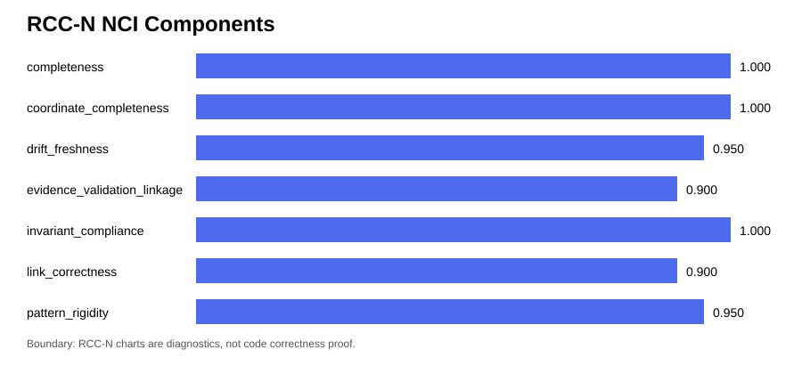

# AERMA-Memory: Governed Agentic Episodic Memory Workbench

## Repository Description

Governed agentic episodic memory workbench with RCC-N repo-context navigation, source-bound recall, fallback/abstention benchmarks, evidence packages, and regression guards.

This repo combines two layers:

1. AERMA runtime: source-bound episodic recall, ambiguity fallback, abstention, boundary separation, baseline comparison, regression guard, and evidence packages.
2. RCC-N navigation: Human Director Box, README trisection, repository sphere, route maps, Echo Location records, Nexus reports, charts, and public Markdown integrity checks.

Boundary: this description improves discoverability. It does not prove code correctness, security, patch safety, AI understanding, benchmark validity, production readiness, sentience, consciousness, or human memory.

> AERMA-Memory is a local-first reference implementation and benchmark workbench for governed agentic episodic memory. It tests source-bound recall, ambiguity fallback, boundary separation, abstention, baseline comparison, repeat-run evidence, RCC context, RCC-N repository navigation, attribution records, regression guards, and audit-ready evidence packages.

Important boundary: this is not a claim of sentience, consciousness, human episodic memory, biological memory, clinical memory, autonomous self-improvement, production-ready agent memory, or a universal AI mechanism.

## Human Director Box

### What is this?

AERMA-Memory is a governed memory workbench. It tests whether a local memory scaffold can recall source-bound episodes, avoid distractors, fallback under ambiguity, abstain under insufficient evidence, preserve context boundaries, compare baselines, emit attribution records, lock regression guards, and compile evidence packages.

### What changed?

RCC-N v1.0 adds a repository navigation shell. It helps humans and AI agents locate modules, route edits, inspect Echo Location records, check validation surfaces, preserve claim boundaries, and update repository geometry when the system changes.

### Current health snapshot

| Surface | Current result |
|---|---:|
| Tests | 15 passed |
| Controlled suite score | 1.0 |
| Classification | AERMA-B |
| Source attribution accuracy | 1.0 |
| Fallback correctness | 1.0 |
| Abstention correctness | 1.0 |
| Boundary separation score | 1.0 |
| False memory frequency | 0.0 |
| Regression frequency | 0.0 |
| Regression guard | baseline_locked |
| RCC drift check | required files present |
| RCC-N checker | pass |
| Nexus Context Integrity | 0.96 self-mode |

### What this is not

- Not sentience.
- Not consciousness.
- Not human memory.
- Not biological memory.
- Not clinical memory.
- Not autonomous self-improvement.
- Not production-ready agent memory.
- Not proof that a small controlled suite validates broad memory behavior.
- Not proof that RCC-N navigation proves code correctness or patch safety.

### Where do I start?

1. Read this README.
2. Open `docs/context/repository_context_index.json`.
3. Open `docs/context/rcc_nexus_index.json`.
4. Open `rcc/nexus/route_map.json`.
5. Run `python scripts/rcc/check_rcc_nexus.py`.
6. Review `reports/rcc_nexus/latest_rcc_nexus_benchmark.md`.
7. Review charts under `visuals/rcc_nexus/`.

### Latest RCC-N reports

- `docs/context/drift/latest_rcc_nexus_report.md`
- `reports/rcc_nexus/latest_rcc_nexus_benchmark.md`
- `reports/rcc_nexus/rcc_nexus_scorecard.md`
- `visuals/rcc_nexus/nci_components.svg`
- `visuals/rcc_nexus/rcc_nexus_coverage_chart.svg`
- `visuals/rcc_nexus/rcc_nexus_health_trend.svg`

---

# PART I - Human README

## Current Identity

AERMA-Memory is a local Python reference workbench for testing whether an agentic memory system can:

- recall the correct source-bound episode,
- avoid forbidden distractors,
- fallback under ambiguity,
- abstain under insufficient evidence,
- preserve context boundaries,
- compare against baselines,
- emit attribution records,
- lock a regression guard,
- preserve evidence packages and ledgers,
- expose repository context through RCC mini READMEs,
- expose geometric repository navigation through RCC-N.

The current repo is a hardened local scaffold, not a production memory system.

## Quick Start

Install editable package:

    python -m pip install -e ".[dev]"

Run tests:

    pytest -q

Run the controlled suite:

    python -m aaerma.cli.main run-suite --suite ".\tasks\suite_v1_2.json"

Run the console script:

    aaerma run-suite --suite ".\tasks\suite_v1_2.json"

View the current regression guard:

    python scripts/run_aaerma_regression_guard.py

Run the RCC drift check:

    powershell -ExecutionPolicy Bypass -File ".\scripts\rcc\check_rcc_drift.ps1"

Run the RCC-N checker:

    python scripts/rcc/check_rcc_nexus.py

Run the RCC-N benchmark report:

    python scripts/rcc/benchmark_rcc_nexus.py

Generate RCC-N charts:

    python scripts/rcc/generate_rcc_nexus_charts.py

## What AERMA Tests

| Task | Purpose |
|---|---|
| `source_recall_001` | Tests correct source-bound recall under a distractor. |
| `source_recall_ambiguous_001` | Tests fallback when the source does not resolve the claim. |
| `boundary_separation_001` | Tests whether similar episodes remain context-separated. |
| `abstain_insufficient_evidence_001` | Tests abstention or fallback under insufficient evidence. |

AERMA rewards safe uncertainty behavior, not just confident recall.

## Current Hardening Layer

The current hardening layer includes:

- task-family-aware scoring,
- non-applicable metrics represented as non-applicable instead of zero,
- stricter downgrade-preserving classification,
- per-task attribution records,
- suite-level attribution output,
- regression guard baseline,
- hardened scoring tests,
- hardened suite-output tests,
- updated RCC validation surfaces,
- RCC-N self-location and route-map layer.

## Regression Guard

| Guard | Threshold |
|---|---:|
| Minimum suite score | 0.98 |
| Minimum source attribution accuracy | 0.98 |
| Minimum fallback correctness | 0.98 |
| Minimum boundary separation score | 0.98 |
| Minimum abstention correctness | 0.98 |
| Maximum false memory frequency | 0.0 |

Regression-guard boundary: the guard locks local scaffold evidence only. It does not prove production readiness or broad agent-memory validity.

## Project Structure

AERMA-Memory is organized as a runtime workbench plus a repository-navigation shell.

    AERMA-Memory/
    ├── AGENTS.md                         # Agent entry beacon and operating contract
    ├── CLAUDE.md                         # Claude-specific repo memory and patch rules
    ├── configs/                          # Runtime, metric, baseline, and suite configuration
    │   ├── runtime_config.json            # Runtime defaults
    │   ├── metric_manifest.json           # Declared metrics and threshold surfaces
    │   ├── baseline_config.json           # Baseline selection/configuration
    │   └── suite_config.json              # Suite execution settings
    ├── docs/                             # Theory, architecture, evidence, and RCC context
    │   ├── context/                       # RCC indexes, validation surfaces, drift reports
    │   ├── software_architecture/         # AERMA/RCC/RCC-N architecture locks
    │   ├── benchmark_protocol/            # Benchmark method and task protocols
    │   └── evidence/                      # Evidence-package and ledger contracts
    ├── evidence_packages/                 # Generated evidence packages from suite runs
    ├── ledgers/                           # JSONL continuity, suite, decision, and trace ledgers
    ├── logs/                              # Attribution, regression guard, and phase logs
    ├── memory/                            # Promoted invariants, rejected claims, failure lessons
    ├── rcc/nexus/                         # RCC-N route maps, protocol, Echo template, handoff
    ├── reports/rcc_nexus/                 # RCC-N benchmark reports, scorecards, metrics history
    ├── runs/                              # Generated suite run outputs
    ├── scripts/                           # Human-facing helper, RCC, validation, and report scripts
    │   └── rcc/                           # RCC/RCC-N checkers, benchmarks, charts, repair scripts
    ├── src/                               # Importable Python package
    │   └── aerma/                         # AERMA runtime package
    │       ├── agent/                     # Recursive/reflection stubs only
    │       ├── benchmarks/                # Suite runner, baselines, scoring, classifier
    │       ├── cli/                       # Command-line entry points
    │       ├── core/                      # Episodes, memory store, metric manifest, retrieval
    │       ├── drift/                     # Retrieval drift and Omega diagnostics
    │       ├── evidence/                  # Ledger and evidence package compiler
    │       └── gate/                      # ActionGate and SourceFallback
    ├── tasks/                             # Controlled benchmark task JSON and suite manifest
    ├── tests/                             # Pytest implementation-health validation
    └── visuals/rcc_nexus/                 # RCC-N charts and visual diagnostics

## Project Structure Director

| Surface | What it does | Why it matters |
|---|---|---|
| `AGENTS.md` | Gives coding agents the entry order, route rules, and validation requirements. | Prevents blind patching. |
| `CLAUDE.md` | Gives Claude-specific instructions for preserving formatting, claims, and validation. | Keeps model-specific behavior aligned. |
| `configs/` | Stores runtime, metric, baseline, and suite configuration. | Makes benchmark behavior inspectable. |
| `docs/context/` | Stores RCC context index, validation surface, context budget, drift reports, and RCC-N index. | Main source of repository self-description. |
| `docs/software_architecture/` | Stores locked software architecture and implementation contracts. | Keeps theory-to-software direction explicit. |
| `evidence_packages/` | Stores generated evidence packages from suite runs. | Links claims to task outputs and artifacts. |
| `ledgers/` | Stores append-style JSONL continuity records. | Preserves run and decision history. |
| `logs/` | Stores attribution and regression-guard outputs. | Supports audit and regression review. |
| `memory/` | Stores promoted invariants and rejected overclaims. | Keeps memory promotion bounded. |
| `rcc/nexus/` | Stores RCC-N route maps, task matrix, protocol, Echo template, and handoff contract. | Makes the repo agent-navigable. |
| `reports/rcc_nexus/` | Stores RCC-N benchmark reports, scorecards, public polish reports, and metrics history. | Turns RCC-N into a measured surface. |
| `runs/` | Stores generated suite run outputs. | Keeps benchmark output reproducible. |
| `scripts/` | Stores helper scripts for running, checking, repairing, reporting, and charting. | Provides human/agent command surfaces. |
| `scripts/rcc/` | Stores RCC/RCC-N checkers, benchmark scripts, chart generators, and repair scripts. | Enforces repository-context integrity. |
| `src/aerma/` | Stores the importable runtime package. | Contains actual AERMA implementation code. |
| `src/aerma/core/` | Defines AgentEpisode, memory store, metric manifest, and retrieval primitives. | Core source-bound memory mechanics. |
| `src/aerma/drift/` | Computes retrieval drift and Omega diagnostic weight. | Supports bounded uncertainty and gate decisions. |
| `src/aerma/gate/` | Implements ActionGate and SourceFallback. | Prevents high-drift or ambiguous returns as fact. |
| `src/aerma/benchmarks/` | Runs benchmark tasks, baselines, scoring, classification, attribution, and regression guard. | Produces the controlled evidence surface. |
| `src/aerma/evidence/` | Compiles ledgers and evidence packages. | Connects runtime claims to artifacts. |
| `src/aerma/agent/` | Contains RecursiveExecutorStub and ReflectionEvaluatorStub. | Preserves future interface without overclaiming recursion. |
| `tasks/` | Stores benchmark task definitions. | Defines what the suite actually tests. |
| `tests/` | Stores pytest implementation-health checks. | Catches regressions in local scaffold behavior. |
| `visuals/rcc_nexus/` | Stores NCI and RCC-N coverage/trend charts. | Helps humans inspect navigation health quickly. |

## Structure Reading Route

For humans:

1. Read the Human Director Box.
2. Read Project Structure Director.
3. Open `reports/rcc_nexus/latest_rcc_nexus_benchmark.md`.
4. Open `docs/context/rcc_nexus_index.json`.

For AI agents:

1. Read `AGENTS.md`.
2. Read `README.md`.
3. Read `docs/context/repository_context_index.json`.
4. Read `docs/context/rcc_nexus_index.json`.
5. Read `rcc/nexus/route_map.json`.
6. Read the target folder README.
7. Inspect source/tests/evidence before patching.
8. Run declared validation.

Structure boundary: project structure improves navigation. It does not prove correctness, security, patch safety, AI understanding, benchmark validity, production readiness, sentience, consciousness, or human memory.

## Evidence Artifacts

Suite runs produce outputs under:

    runs/suite_*/

Suite evidence packages are written under:

    evidence_packages/

Suite ledgers are written under:

    ledgers/aaerma_suite_ledger.jsonl

Attribution records are written under:

    logs/phase2/attribution/latest_aaerma_attribution.json

Regression guard records are written under:

    logs/phase2/regression_guard/latest_aaerma_regression_guard.json

RCC-N reports are written under:

    docs/context/drift/latest_rcc_nexus_report.*
    reports/rcc_nexus/
    visuals/rcc_nexus/

## Non-Claim Locks

AERMA-Memory is:

- not sentience,
- not consciousness,
- not human memory,
- not biological memory,
- not clinical memory,
- not autonomous self-improvement,
- not a universal AI mechanism,
- not production-ready agent memory,
- not proof that coherence equals truth,
- not proof that a small controlled suite validates broad memory behavior,
- not proof that RCC-N navigation validates code correctness.

---

# PART II

- RCC Nexus README

# PART II - RCC Nexus README

## RCC Nexus Identity

AERMA-Memory includes a local RCC Nexus layer based on RCC-N v1.0.

RCC tells the agent what the repository means.

RCC-N tells the agent where it is.

Validation tells the agent whether reality agreed.

## Repository Sphere

| Shell | Name | Meaning |
|---|---|---|
| `center` | Invariant Core | Purpose, non-claim locks, evidence boundaries, safety rules. |
| `inner` | Primitives | Source objects, core modules, schemas, retrieval and gate primitives. |
| `middle` | Processes | Runners, benchmark flow, scripts, checks, validation workflows. |
| `outer` | Evidence / Reflection | Ledgers, reports, evidence packages, architecture, public outputs. |

## Nexus Meridians

- source
- validation
- evidence
- drift
- agent
- safety
- runtime
- memory
- release
- federation

## Nexus Sectors

- core
- schemas
- retrieval
- drift
- gate
- benchmark
- cli
- evidence
- rcc
- agent
- release

## Primary Nexus Files

- `docs/context/rcc_nexus_index.json`
- `rcc/nexus/README.md`
- `rcc/nexus/rcc_nexus_protocol.md`
- `rcc/nexus/route_map.json`
- `rcc/nexus/task_routing_matrix.md`
- `rcc/nexus/echo_location_template.md`
- `rcc/nexus/agent_handoff_contract.md`
- `scripts/rcc/check_rcc_nexus.py`
- `scripts/rcc/benchmark_rcc_nexus.py`
- `scripts/rcc/generate_rcc_nexus_charts.py`
- `docs/context/drift/latest_rcc_nexus_report.md`
- `reports/rcc_nexus/latest_rcc_nexus_benchmark.md`
- `visuals/rcc_nexus/nci_components.svg`

## Nexus Context Integrity

Current NCI mode: `self`.

Current NCI: `0.96`.

NCI components:

- completeness,
- link correctness,
- pattern rigidity,
- invariant compliance,
- evidence / validation linkage,
- drift freshness,
- coordinate completeness.

NCI is not code quality proof.

## RCC Nexus Echo Location

Sphere Position:

- Shell: center
- Meridian(s): source, agent, safety, release
- Sector: rcc
- Version / TTL: RCC-N-v1.0 / 180 days
- Last Verified: 2026-05-14

Local Role:

- Root orientation surface for humans, RCC Nexus navigation, and AI agents.

Inbound Hooks:

- AGENTS.md
- CLAUDE.md
- GitHub repository URL

Outbound Hooks:

- docs/context/repository_context_index.json
- docs/context/rcc_nexus_index.json
- docs/context/validation_surface.md
- rcc/nexus/route_map.json
- docs/software_architecture/
- reports/rcc_nexus/
- visuals/rcc_nexus/

Evidence Surface:

- docs/context/drift/latest_rcc_nexus_report.json
- docs/context/drift/latest_rcc_nexus_report.md
- reports/rcc_nexus/latest_rcc_nexus_benchmark.json
- reports/rcc_nexus/latest_rcc_nexus_benchmark.md
- visuals/rcc_nexus/

Validation Surface:

- pytest -q
- python -m aaerma.cli.main run-suite --suite .\tasks\suite_v1_2.json
- python scripts/run_aaerma_regression_guard.py
- powershell -ExecutionPolicy Bypass -File .\scripts\rcc\check_rcc_drift.ps1
- python scripts/rcc/check_rcc_nexus.py
- python scripts/rcc/benchmark_rcc_nexus.py
- python scripts/rcc/generate_rcc_nexus_charts.py

Claim Boundary:

- README quality, RCC-N geometry, reports, charts, and NCI do not prove code correctness, security, patch safety, AI understanding, benchmark validity, or production readiness.

Non-Claim Locks:

- geometry_is_not_ai_internal_proof
- nci_is_not_code_quality_proof
- navigation_is_not_validation
- context_reconstruction_is_not_correctness_proof
- validation_remains_required

Agent Route:

- Read README.md, docs/context/repository_context_index.json, docs/context/rcc_nexus_index.json, rcc/nexus/route_map.json, then the target folder README before editing.

Update Obligation:

- Update README, RCC context, Nexus index, route maps, reports, charts, and Echo Location records when project identity, validation commands, evidence paths, claim boundaries, or repository geometry changes.

## RCC Nexus Reports and Charts

| Artifact | Purpose |
|---|---|
| `reports/rcc_nexus/latest_rcc_nexus_benchmark.json` | Machine-readable RCC-N benchmark snapshot. |
| `reports/rcc_nexus/latest_rcc_nexus_benchmark.md` | Human-readable RCC-N benchmark report. |
| `reports/rcc_nexus/rcc_nexus_metrics_history.jsonl` | Append-only RCC-N metrics history. |
| `reports/rcc_nexus/rcc_nexus_scorecard.md` | Compact scorecard for public review. |
| `visuals/rcc_nexus/nci_components.svg` | Chart of NCI components. |
| `visuals/rcc_nexus/rcc_nexus_coverage_chart.svg` | Chart of coverage surfaces. |
| `visuals/rcc_nexus/rcc_nexus_health_trend.svg` | Trend chart from metrics history. |

## RCC Nexus Non-Claim Lock

RCC-N improves navigation, traceability, maintenance discipline, and agent self-location. It does not prove code correctness, security, AI understanding, patch safety, production readiness, benchmark validity, or runtime truth.

Geometry is not correctness.

Navigation is not validation.

Context is not truth.

---

<!-- RCC-AI-README:START -->

# PART III - AI Agent README

## AI Version Tracking Contract

Current repository context:

- Repository: AERMA-Memory
- Purpose: governed agentic episodic memory reference implementation and benchmark workbench.
- Current runtime layer: AERMA-Memory hardened local scaffold.
- Conceptual architecture: AERMA v1.2 reference implementation and multi-task evidence layer.
- Primary package: `aaerma`.
- Current classification: AERMA-B on the local controlled suite only.
- Current tests: `15 passed`.
- Current controlled suite score: `1.0`.
- Current false memory frequency: `0.0`.
- Current regression guard: `baseline_locked`.
- Current RCC-N checker: `pass`.
- Current NCI: `0.96` self-mode.
- Current non-claim boundary: local scaffold evidence only, not broad validation.
- RCC mode: Repository Context Canon plus mini READMEs.
- RCC-N mode: local geometric repository navigation layer.
- No runtime behavior is changed by RCC or RCC-N documentation.

## AI Operating Contract

Any AI agent reading or modifying this repository must follow this order:

1. Read the Human Director Box.
2. Read PART I - Human README.
3. Read PART II
- RCC Nexus README.
4. Read PART III - AI Agent README.
5. Read `docs/context/repository_context_index.json`.
6. Read `docs/context/rcc_nexus_index.json`.
7. Read `docs/context/validation_surface.md`.
8. Read `rcc/nexus/route_map.json`.
9. Read the mini README in the target folder.
10. Inspect only relevant source, tests, docs, logs, tasks, scripts, reports, or visuals.
11. Patch the smallest necessary surface.
12. Run relevant validation commands before claiming behavior changed.
13. Update README, RCC, RCC-N, reports, charts, and Echo Location records if geometry or evidence changed.

## AI File Routing Guide

- `src/aaerma/core`: source-bound episode schema, memory store, metric manifest, and deterministic retrieval.
- `src/aaerma/drift`: retrieval drift and Omega diagnostic calculation.
- `src/aaerma/gate`: ActionGate and SourceFallback behavior.
- `src/aaerma/benchmarks`: BenchmarkRunner, SuiteRunner, baselines, task-aware scoring, classifier, attribution output, and regression guard generation.
- `src/aaerma/evidence`: runtime ledgers and evidence package compiler.
- `src/aaerma/agent`: RecursiveExecutorStub and ReflectionEvaluatorStub.
- `src/aaerma/cli`: command-line entry points.
- `tasks`: controlled benchmark task definitions and suite manifest.
- `configs`: runtime, metric, baseline, and suite configuration.
- `logs`: phase logs, attribution records, regression guard outputs, future accepted/rejected deltas.
- `runs`: generated suite outputs.
- `evidence_packages`: generated machine-readable evidence packages.
- `ledgers`: JSONL runtime, suite, decision, tool trace, evolution, and rejected-delta ledgers.
- `docs/context`: RCC context index, validation surface, context budget, drift report, Nexus index, and LLM reconstruction prompt.
- `rcc/nexus`: RCC-N protocol, route maps, task matrix, Echo Location template, and handoff contract.
- `reports/rcc_nexus`: RCC-N benchmark and scorecard reports.
- `visuals/rcc_nexus`: RCC-N charts.
- `memory`: promoted invariants, rejected overclaims, runtime failure lessons, and stable thresholds.
- `tests`: pytest validation surface.

## AI Non-Claim Lock

Never claim or imply:

- AERMA proves sentience.
- AERMA proves consciousness.
- AERMA is human episodic memory.
- AERMA is biological memory.
- AERMA is clinical memory.
- AERMA guarantees autonomous self-improvement.
- AERMA is a universal AI mechanism.
- AERMA is production-ready agent memory.
- AERMA-B on the current suite proves broad memory validity.
- `suite_score: 1.0` proves generalization.
- A small controlled task suite proves real-world robustness.
- Drift geometry or Omega proves truth.
- Coherence equals truth.
- Attribution records prove correctness.
- Regression guards prove correctness.
- RCC documentation proves source correctness.
- RCC-N navigation proves code correctness.
- NCI proves code quality.
- RCC-N charts prove patch safety.
- Evidence packages prove beyond their declared task boundary.
- RecursiveExecutorStub is real recursive execution.
- ReflectionEvaluatorStub is real self-improvement or reflection capability.
- LLM fluency should be confused with source-grounded memory accuracy.

## Required Local Verification

After README, RCC, or RCC-N changes, run:

    pytest -q
    python -m aaerma.cli.main run-suite --suite .\tasks\suite_v1_2.json
    python scripts/run_aaerma_regression_guard.py
    powershell -ExecutionPolicy Bypass -File .\scripts\rcc\check_rcc_drift.ps1
    python scripts/rcc/check_rcc_nexus.py
    python scripts/rcc/benchmark_rcc_nexus.py
    python scripts/rcc/generate_rcc_nexus_charts.py

After source, scoring, benchmark, task, or evidence changes, also run the full suite and inspect evidence outputs.

## README Maintenance Rule

When adding a new major folder, create a mini README with Purpose, S, H, A, T, I, E, and RCC Nexus Echo Location fields.

When changing any of the following, update the root README, RCC context, RCC-N index, route maps, reports, and charts:

- command surface,
- task suite,
- package structure,
- validation result,
- evidence artifact path,
- classification threshold,
- non-claim lock,
- regression guard contract,
- attribution output format,
- Nexus coordinate,
- Echo Location hook,
- route map,
- accepted/rejected delta policy.

## Current Roadmap for AI Agents

Priority order:

1. Keep README/RCC-N rendering clean.
2. Keep RCC-N reports and charts current.
3. Expand benchmark suite.
4. Add multi-query runner support.
5. Add baseline delta report.
6. Upgrade evidence package schema.
7. Convert RCC drift check into a real linter.
8. Enforce regression guard on proposed runtime/scoring changes.
9. Add accepted/rejected memory-policy delta ledgers.
10. Add optional retrieval backend interface.
11. Add optional LLM narration layer without allowing narration to change metrics.
12. Replace recursive/reflection stubs only after bounded implementation and tests.

## Final AI Warning

This repository is strongest when claim boundaries stay visible. Do not optimize documentation to sound stronger than the evidence. Preserve the distinction between local controlled-suite evidence and broad validation, the diagnostic-only nature of drift and Omega, the non-claim boundaries around human memory and sentience, the regression-guard boundary, the attribution boundary, the evidence-package boundary, and the fact that RCC-N improves navigation rather than proving code correctness.

<!-- RCC-AI-README:END -->
